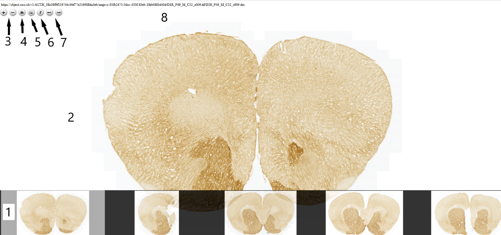

**Multi-Image-OSd viewer**

**Basic controls**

In Multi-Image-OSd viewer, serial section images (1) are represented in
a filmstrip at the bottom of the webpage user interface, with the
selected section image (2) in the main view.

In the upper panel, users can pan and zoom using the “+” and “-“ signs
or the mouse scroll wheel (3); the home button (4) allow users to go
back to the default field of view.

The next squared icon (5) allow users to toggle to a full page view. The
question mark (6) give access to Navigation tips (also described below).

The left and right arrows allow to go to the next image or back (7). The
name of the image file (8).

**Navigation tips**

-  Mouse

Click and drag to pan the image

Use wheel to zoom in and out

Click to zoom in and hold shift and click to zoom out

-  Touchpad

Click and drag to pan the image

Two-fingers scroll allows zoom in and zoom out

Click to zoom in and hold shift and click to zoom out

-  Keyboard keys

"+" to zoom in, "-" to zoom out

Arrows or "w", "s", "a", "d" keys to pan an image

"0" (zero) key resets an image

-  Mobile devices

Drag to pan the image

Double tap to zoom in

Pinch to zoom out, spread to zoom in

**Collection Mode**

By appending the string “&collectionMode=true” to the url, all image
sections are visible and can be zoom onto as well.

.. image:: vertopal_1621aadde82348db9f1e3d1cbe6214f5/media/image3.png
   :width: 6.3in
   :height: 2.94792in
