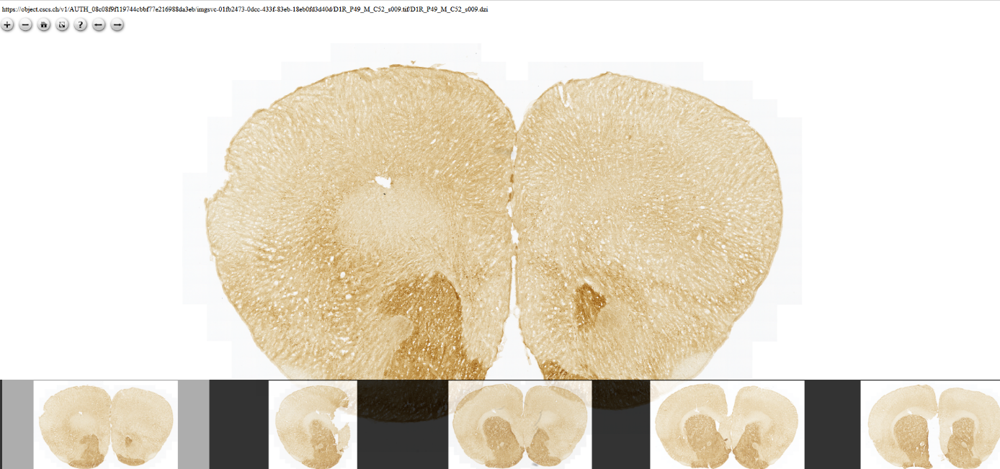

**Introduction**
================

EBRAINS Multi-Image OpenSeadragon viewer provides an intuitive way of
navigating high-resolution 2D image series. It has browser-based classic
pan and zoom capabilities. A collection can be displayed as a filmstrip
(Filmstrip Mode) or as a table (Collection Mode) with adjustable number
of row and columns. The navigation options: keyboard or/and mouse, touch
devices are supported too.

Building on the open standard Deep Zoom Image (DZI) format, it is able
to efficiently visualise very large brain images in the gigapixel range,
allowing to zoom from common, display-sized overview resolutions down to
the microscopic resolution without downloading the underlying very large
image dataset.

